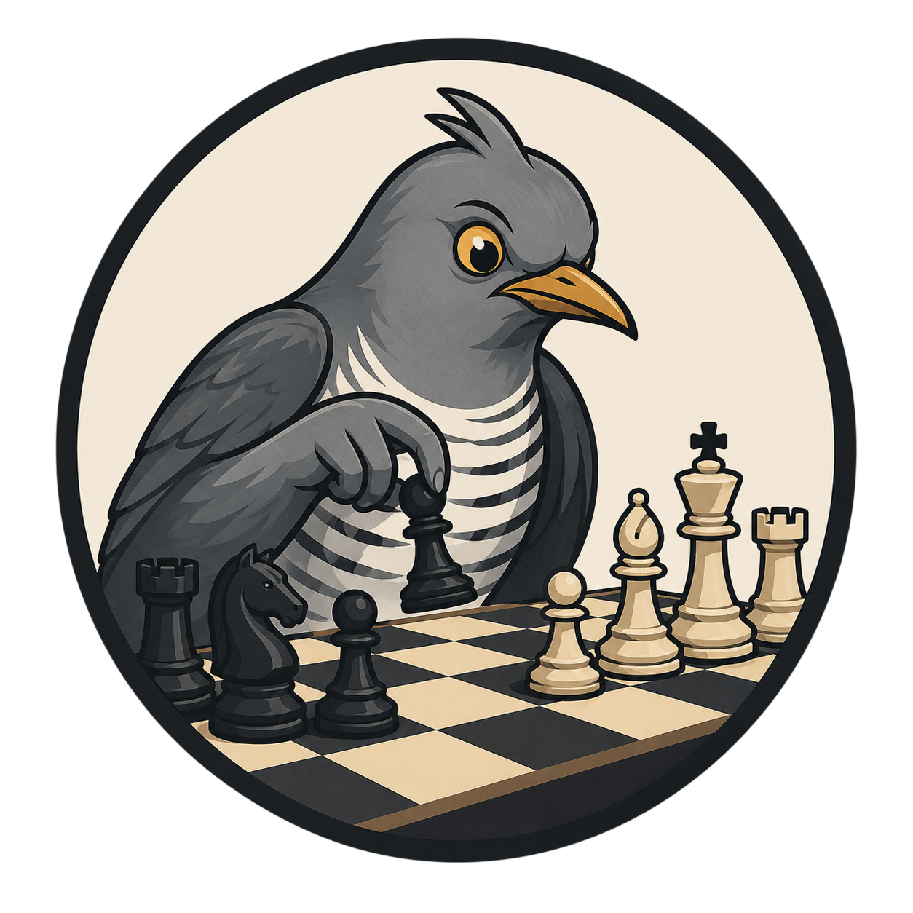
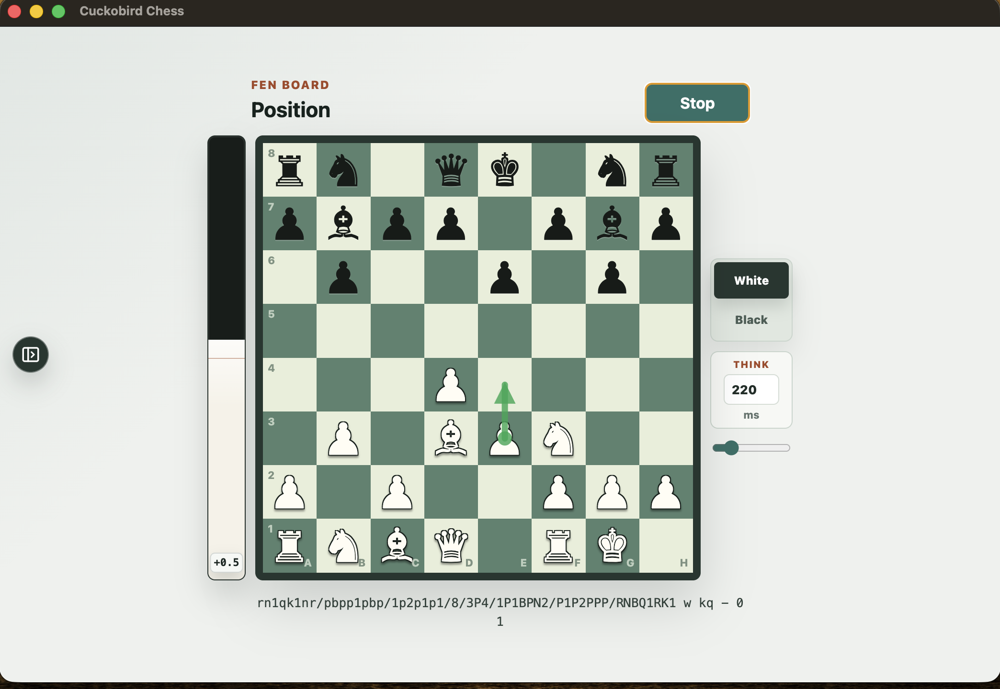

# Cuckobird Chess

<p align="center">
  
</p>

> [!WARNING]
> **Fair-play disclaimer:** This project is provided only for education, research, and entertainment purposes. Do not use it to cheat, receive live engine assistance, or gain an unfair advantage in online games, rated games, tournaments, or any setting where engine help is not explicitly allowed.

Cuckobird Chess is a local Electron desktop app for reading chess positions from a screen, window, or camera source. It detects the board, recognizes the position as FEN with an ONNX model, asks Stockfish and Maia for moves, and exposes the latest evaluation through a localhost API.

<p align="center">
  
</p>

## Requirements

- Node.js `>=22.12.0`
- pnpm `>=9.4.0`
- Stockfish available on `PATH`, or `STOCKFISH_PATH` pointing to the engine executable
- Optional for Maia's orange arrow: Lc0 available on `PATH`, or `LC0_PATH` pointing to the `lc0` executable
- Optional: Tesseract available on `PATH`, or `TESSERACT_PATH` pointing to the OCR executable, for OCR-assisted board orientation
- Runtime model file: `models/piece-model.onnx`

## Installation

Install Node.js `22.12.0` or newer and Stockfish, then install the app dependencies from this repo. Lc0 is optional and only needed for Maia. Tesseract is optional; the commands below include it where available because it can improve board-orientation detection.

## macOS

```bash
brew install node stockfish lc0 tesseract
corepack enable
corepack prepare pnpm@9.4.0 --activate
pnpm install
pnpm start
```

On first capture, macOS may ask for Screen & System Audio Recording permission. Enable it, quit the app, and run `pnpm start` again.

## Linux

Ubuntu/Debian:

```bash
curl -fsSL https://deb.nodesource.com/setup_22.x | sudo -E bash -
sudo apt update
sudo apt install -y nodejs stockfish tesseract-ocr
corepack enable
corepack prepare pnpm@9.4.0 --activate
pnpm install
pnpm start
```

For other distros, install Node.js `22.12.0` or newer, `stockfish`, optional `lc0`, and `tesseract` with your package manager, then run the Corepack and pnpm commands above.

## Windows

PowerShell:

```powershell
winget install -e --id OpenJS.NodeJS.LTS
winget install -e --id UB-Mannheim.TesseractOCR
corepack enable
corepack prepare pnpm@9.4.0 --activate
pnpm install
pnpm start
```

Install Stockfish from [stockfishchess.org/download](https://stockfishchess.org/download/), unzip it, then set `STOCKFISH_PATH` to the executable:

```powershell
[Environment]::SetEnvironmentVariable("STOCKFISH_PATH", "C:\Tools\stockfish\stockfish.exe", "User")
```

To use Maia on Windows, install Lc0 from [lczero.org](https://lczero.org/play/download/) and set `LC0_PATH`:

```powershell
[Environment]::SetEnvironmentVariable("LC0_PATH", "C:\Tools\lc0\lc0.exe", "User")
```

If Tesseract is not added to `PATH`, set:

```powershell
[Environment]::SetEnvironmentVariable("TESSERACT_PATH", "C:\Program Files\Tesseract-OCR\tesseract.exe", "User")
```

Restart PowerShell after changing environment variables.

## Quick Start

```bash
corepack enable
corepack prepare pnpm@9.4.0 --activate
pnpm install
pnpm start
```

Choose a source, then click **Start**. The app will monitor the selected source and update when the board changes.

## Useful Commands

```bash
pnpm run build
pnpm run typecheck
pnpm run dev
pnpm run crop-board:build -- path/to/screenshot.png
pnpm run start:debug
pnpm run crop-board:debug -- path/to/screenshot.png
pnpm run profile:report
pnpm run package:dir
pnpm run package
```

`pnpm run package` creates platform installers in `release/`. Stockfish, Lc0, and Tesseract are not bundled; users should install them separately or set `STOCKFISH_PATH`, `LC0_PATH`, and `TESSERACT_PATH`.

## Configuration

- `STOCKFISH_PATH`: absolute path to a Stockfish executable when it is not on `PATH`.
- `LC0_PATH`: absolute path to an Lc0 executable when it is not on `PATH`. Maia weights are downloaded to app data on first use for the selected rating. The Maia arrow uses a small Lc0 search on the Maia net so it is stronger than pure one-node Maia.
- `TESSERACT_PATH`: absolute path to a Tesseract executable when it is not on `PATH`.
- `CUCKOBIRD_CHESS_DEBUG=1` or `DEBUG_CUCKOBIRD_CHESS=1`: enables debug artifacts and capture profiling. You can also use `pnpm run start:debug`.

## Local API

The app starts a local-only HTTP server when it launches. It prefers port `7000` and falls back to a random free port if needed. The sidebar shows the active URL.

- `GET /eval`: returns JSON with the latest Stockfish and Maia moves, Stockfish eval when available, and detected board side, such as `{"top":"Nf3","stockfish":"Nf3","maia":"Be2","eval":"+0.8","board_side":"white"}`.

## Privacy Notes

Screenshot and camera frames are analyzed locally in memory. The app does not send positions or moves to a remote endpoint. When Maia runs, it may download the selected public Maia weights file once and reuse it from app data.

Debug mode saves detected board crops and board metadata to `temp/`, and per-capture profiler JSON files to `temp/profile/`; normal runs do not write those debug PNG or JSON files. `temp/` is ignored by git.

On macOS, the sidebar's Hidden mode toggle asks Electron to protect the app window from screen capture by other apps.

## License

ISC License. 
